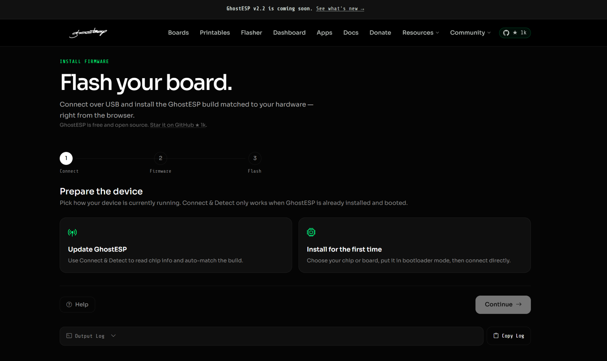
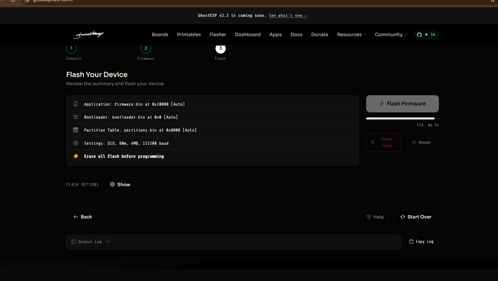

# Exploring ESP32-S3 for Wireless Security Research

**Project:** ESP32-S3 Wireless Security Lab  
**Team/Community:** DragonByte

## 1. Introduction

I started this project to explore how a small IoT device can combine embedded hardware, firmware and wireless communication into a practical security-testing platform.

The project focuses on learning rather than attacking real systems.

## 2. Hardware

The experiment uses an ESP32-S3 development board with Wi-Fi and Bluetooth Low Energy capabilities.

## 3. Firmware Setup

The first stage was preparing the board and installing compatible firmware.

The workflow involved identifying the ESP32-S3, connecting it over USB, entering the required bootloader mode, selecting the correct firmware target and flashing the device.

## 4. Wi-Fi Exploration

After firmware setup, I explored Wi-Fi discovery in a controlled environment.

The purpose was to understand what information an embedded device can observe from nearby wireless networks and how that information can be presented to a security researcher.

## 5. Bluetooth / BLE Exploration

The next area was Bluetooth Low Energy.

I explored device discovery and advertising behaviour using test devices. This helped me understand how IoT devices announce their presence and how wireless visibility can become part of an organization's attack surface.

## 6. Captive Portal Demonstration

I also explored the captive-portal concept using a controlled lab.

A test mobile device was connected to the test environment and the behaviour of the local portal was observed.

The purpose was educational: understand the client/network interaction, not collect credentials or impersonate a real service.

## 7. Mobile Testing

Mobile testing was useful because phones handle captive portals and wireless connections differently depending on the operating system and network conditions.

## 8. What I Learned

This project gave me practical exposure to:

- ESP32-S3 hardware
- Firmware flashing
- Bootloader concepts
- Wi-Fi discovery
- BLE discovery
- Captive portals
- Mobile network behaviour
- IoT security methodology

## 9. Security Perspective

The project also highlighted an important point: wireless-security tools can be used for both defensive research and misuse.

For that reason, all experiments should have a defined scope and authorization.

## 10. Conclusion

This experiment was a useful step in my IoT and cybersecurity learning journey.

The biggest takeaway was seeing the complete chain:

**Embedded Hardware → Firmware → Wireless Communication → Mobile Device → Security Observation**

I plan to continue exploring IoT security in controlled environments and use these skills for defensive research and learning.

---

## Responsible-use statement

This project is intended for educational and authorized security testing only.

Do not use the techniques described here to access, disrupt or collect information from networks or devices without permission.
