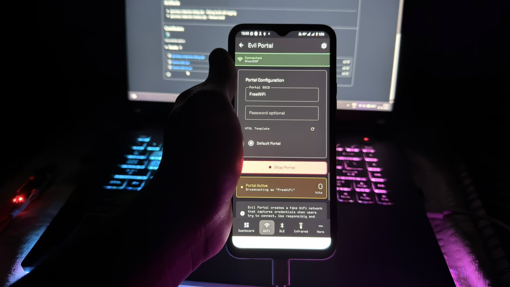

# 07 — Mobile Testing

## Objective

Observe how a mobile device responds to a controlled wireless test environment.

The tests can include:

- Joining a test Wi-Fi network
- Opening a local test page
- Observing captive-portal handling
- Disconnecting and reconnecting
- Comparing behaviour across devices

## iPhone note

The goal is to study normal captive-network behaviour, not to impersonate trusted services or collect user credentials.

Use only your own test device or a device whose owner has explicitly authorized the experiment.
